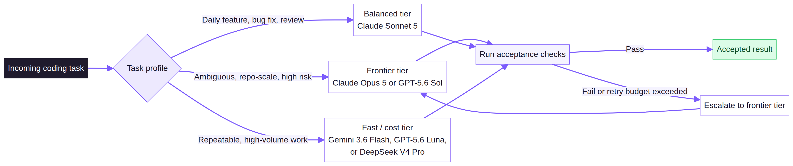

# Best LLM for Coding in 2026: Choose by Task and Cost

**Updated August 26, 2026**

There is no universal best LLM for coding. For difficult repository-scale or long-running agent work, begin your evaluation with **Claude Opus 5** and **GPT-5.6 Sol**. For a balanced production default, test **Claude Sonnet 5**. For fast, high-volume work, compare **Gemini 3.6 Flash** and **GPT-5.6 Luna**. When API cost is the primary constraint, include **DeepSeek V4 Pro** in the test set.

The right coding model is not necessarily the benchmark leader. It is the model that completes your own tasks reliably, within the required latency, at the **lowest total cost per accepted result**. That total includes failed attempts, retries, tool calls, generated tokens, and engineer review time—not only the provider’s input-token price.

## Best coding LLMs at a glance

**Quick answer:** Start hard agentic evaluations with Claude Opus 5 and GPT-5.6 Sol; use Claude Sonnet 5 as the balanced baseline; test Gemini 3.6 Flash and GPT-5.6 Luna for fast, repeatable work; and add DeepSeek V4 Pro to a cost-focused comparison.

| Model | Best starting use | Upstream price per 1M tokens (input / output) | Context | Why it belongs in the test set |
|---|---|---:|---:|---|
| Claude Opus 5 | Long-running agents, difficult refactors, high-stakes repository work | $5 / $25 | 1M | Anthropic positions it for complex agentic coding and enterprise work. [2] |
| GPT-5.6 Sol | Complex reasoning, coding, and tool-heavy workflows | $5 / $30 | 1.05M | OpenAI recommends it as a flagship starting point for complex reasoning and coding. [1] |
| Claude Sonnet 5 | Balanced production agents, daily feature work, code review | $3 / $15 list price | 1M | Anthropic describes it as a balance of speed and intelligence with agentic coding and tool use. [2] |
| Gemini 3.6 Flash | Fast agent loops, multimodal inputs, high-throughput tasks | $1.50 / $7.50 | 1M | Google positions it as a speed-focused model for agentic and multimodal tasks. [3] |
| GPT-5.6 Luna | Cost-sensitive generation, triage, repetitive code transformations | $1 / $6 | 1.05M | OpenAI positions it for efficient, high-volume workloads. [1] |
| DeepSeek V4 Pro | Budget-sensitive agents and large-context experiments | $0.435 cache miss / $0.87 output | 1M | DeepSeek documents tool calling, JSON output, thinking modes, and low token pricing. [4] |

Prices are **upstream public list prices in USD**, checked August 18, 2026. Cached input, batch, priority, promotional, tool, and gateway charges may differ. Anthropic’s documentation lists a temporary **$2 / $10** introductory price for Sonnet 5 through August 31, 2026; this comparison uses the normal **$3 / $15** list price so that the decision does not depend on a short-lived promotion. DeepSeek separately lists cache-hit input at **$0.003625 per 1M tokens**. Confirm current ApiFlux availability, model IDs, limits, and displayed prices on the [ApiFlux Models page](https://apiflux.ai/models) before implementation.

> **Editorial scope:** This is a practical shortlist, not an ApiFlux benchmark leaderboard. Provider descriptions are useful for deciding what to test, but they are **vendor capability statements, not proof** that a model will win on your repository.

## Which LLM is best for your coding task?

**Quick answer:** Match the model to task difficulty, required reliability, speed, and total cost. Use frontier models for uncertain, long-horizon work; use balanced models for daily production tasks; and use lower-cost tiers only where their reliability has been proven on the work you will automate.

### Best for difficult agentic coding: Claude Opus 5 or GPT-5.6 Sol

**Verdict:** Claude Opus 5 and GPT-5.6 Sol are the first two models to test for difficult repository-scale coding work.

Use this tier when an agent must inspect a large repository, create a plan, modify several files, run commands, diagnose failures, and continue until tests pass. Anthropic describes Claude Opus 5 as supporting long-context work, tool calling, reasoning, and multi-agent coordination. OpenAI describes GPT-5.6 Sol as a flagship option for complex production workflows and coding. Those descriptions justify inclusion in an evaluation; they do not establish a winner. [1] [2]

Compare both models on identical tasks and record whether each one finds the right files before editing, follows project instructions and architecture, uses tools correctly after a failed command, produces a minimal reviewable diff, and reaches passing tests without human repair. The higher-token-price model may still be more economical if it prevents retries and engineer intervention.

### Best default for production coding agents: Claude Sonnet 5

**Verdict:** Claude Sonnet 5 is a strong balanced baseline for a production coding agent, but it must still earn the default role on your own suite.

Test Sonnet 5 when one model needs to cover feature implementation, debugging, test writing, code review, and routine agent loops. Anthropic positions it as improving reasoning, tool use, coding, and knowledge work while remaining faster and less expensive than its Opus tier. [2]

That positioning makes it a sensible default candidate rather than an automatic choice. Test it against Opus 5 on the hardest tasks and against cheaper models on predictable work. A simple router can reserve the expensive model for escalations while sending routine tasks to the lower-cost tier.

### Best for fast, high-volume coding work: Gemini 3.6 Flash or GPT-5.6 Luna

**Verdict:** Gemini 3.6 Flash and GPT-5.6 Luna are the leading candidates to evaluate when throughput, response time, and unit cost matter more than maximum reasoning depth.

This tier is suited to test-case generation, code classification, documentation updates, structured extraction, lint-fix suggestions, and repetitive migrations. Google lists Gemini 3.6 Flash with a 1M-token context window and positions it for agentic and multimodal work, while OpenAI positions GPT-5.6 Luna for cost-sensitive, high-volume workloads. [1] [3]

Before routing unattended production work to either model, validate structured-output reliability and tool-call accuracy. A low token price does not make a workflow cheaper when malformed outputs, missed constraints, or repeated retries return the work to an engineer.

### Best low-cost candidate: DeepSeek V4 Pro

**Verdict:** DeepSeek V4 Pro is the first low-cost model to add to a budget-focused coding evaluation, particularly for large-context experiments.

DeepSeek V4 Pro merits comparison because its published API pricing is far below the other models in this shortlist. DeepSeek documents a 1M-token context window, tool calls, JSON output, and both thinking and non-thinking modes. [4]

Treat these specifications as a reason to test the model—not as a substitute for testing it. Measure instruction adherence, patch quality, tool-loop stability, latency, and availability across the languages and frameworks your team actually uses. For simpler workloads, include the provider’s V4 Flash tier in the same evaluation.

## The metric that matters: cost per successful coding task

**Quick answer:** Optimize for **cost per successful coding task**, not cost per million tokens. A more expensive model can cost less in production if it succeeds earlier and leaves less work for people.

Token prices are simple to compare and simple to misuse. Agentic coding creates cost across an entire loop:

<code>total task cost = input + cached input + output + tools + retries + review time</code>

Suppose Model A has a much higher output-token price than Model B but usually succeeds on the first attempt. If Model B needs repeated retries and leaves more manual fixes, Model A can be the lower-cost production choice. The conclusion may reverse on a simpler workload, which is why routing should be driven by task type rather than a global ranking.

| Metric | What to record |
|---|---|
| Task success | Tests pass and acceptance criteria are met without a hidden human repair. |
| First-pass success | The task succeeds without retry or escalation. |
| Total tokens | Uncached input, cached input, reasoning, and output tokens. |
| Tool reliability | Valid tool calls, failed commands, loops, and recovery behavior. |
| Wall-clock latency | Time from task start to an accepted result. |
| Review burden | Minutes spent reviewing, correcting, or reverting the patch. |
| Diff quality | Scope control, readability, security, and architectural fit. |

## How to evaluate the best code LLM for your team

**Quick answer:** Build a representative 15–30 task set, hold the environment constant, define executable success criteria, run tasks repeatedly, and route task categories to the model tier that proves best on them.

### 1. Build a representative task set

**Verdict:** Use real repository tasks—not toy functions—because agent failures usually occur in planning, navigation, tool use, and recovery.

Sample 15–30 tasks from real work without exposing production secrets. The suite should include a small bug with a deterministic test, a multi-file feature, repository navigation, a refactor with compatibility constraints, test generation for an existing module, a dependency or configuration migration, and code review with planted defects. A broad mix reveals the operational failures that simple benchmark prompts conceal.

### 2. Keep the environment constant

**Verdict:** Give every model the same repository, tools, instructions, limits, and attempt budget so that the comparison measures models rather than configurations.

Use the same repository snapshot, system instructions, available tools, timeout, token budget, and maximum number of attempts. Pin model IDs when the provider permits it, and record the reasoning setting. Without this control, a comparison may reflect different configurations, not different model behavior.

### 3. Define success before running the model

**Verdict:** A coding task succeeds only when pre-defined acceptance checks pass; a persuasive explanation is not a working patch.

Prefer executable checks such as unit tests, type checks, lint rules, build output, and security scans. Add a narrow human-review rubric for scope control, readability, and architectural fit. This makes success auditable and prevents presentation quality from being mistaken for engineering quality.

### 4. Test more than once

**Verdict:** Run each task several times, then compare success rate with median cost and latency rather than trusting a single result.

LLM output varies between runs. Repeated trials show whether a model is consistently reliable or merely capable of occasional strong results. Review failure categories separately—for example, repository navigation, tool misuse, test regressions, or unnecessary diff scope—instead of compressing every outcome into one average score.

### 5. Route by task instead of forcing one winner

**Verdict:** Most production coding stacks should use at least two model tiers instead of asking one LLM to handle every task.

A practical stack combines a reliable frontier model for ambiguous, long-horizon, or previously failed work with a faster, lower-cost model for routine high-volume tasks. Route based on task risk, repository size, expected tool depth, and whether a deterministic verifier exists. Escalate when tests fail or the model exceeds its retry budget.

## A practical model-selection policy

**Quick answer:** Begin with Claude Sonnet 5 for daily agentic coding, reserve Claude Opus 5 and GPT-5.6 Sol for difficult repository tasks, test Gemini 3.6 Flash and GPT-5.6 Luna for repetitive work, and include DeepSeek V4 Pro when price or long context is important.

Use this policy as a starting hypothesis until your own evaluation data is available:

1. Start daily agentic coding tests with **Claude Sonnet 5**.
2. Run **Claude Opus 5** and **GPT-5.6 Sol** on the hardest repository-scale tasks.
3. Test **Gemini 3.6 Flash** and **GPT-5.6 Luna** on fast, repeatable workloads.
4. Add **DeepSeek V4 Pro** where cost or long context is a priority.
5. Keep the model that produces the **lowest cost per accepted task**, not the lowest token price.

Re-run the evaluation whenever a provider changes a model version, price, context limit, tool interface, or availability. A 2026 coding-model comparison is a dated operational snapshot, not a permanent ranking.

### Model routing framework

Route ambiguous, repository-scale, or high-risk work to the frontier tier; keep daily feature work with the balanced tier; and reserve fast or lower-cost models for repeatable jobs with a clear verifier. Any task that exceeds its retry budget or fails acceptance checks should escalate instead of silently consuming more low-cost attempts.

## Compare coding models through one workflow

**Quick answer:** A unified gateway lets teams run the same evaluation suite across several coding models without implementing a separate integration for every provider.

ApiFlux lets developers select an interface model ID and send requests through OpenAI-compatible, Anthropic, or Gemini protocols. First, verify currently available models, displayed prices, and limits on the [Models page](https://apiflux.ai/models). Then create an API key, complete a first request through the [Quickstart](https://apiflux.ai/docs/quickstart), connect tools such as Claude Code, Codex CLI, or OpenCode, and run your identical task suite across the shortlist.

Use the resulting usage data to compare actual cost, latency, retries, tool-call reliability, and accepted-task rate. The purpose of a shared workflow is not to make vendor claims interchangeable; it is to make your test conditions comparable.

## Frequently asked questions

### What is the best LLM for coding in 2026?

**Verdict:** There is no universal winner. Test Claude Opus 5 and GPT-5.6 Sol for difficult agentic work, Claude Sonnet 5 as a balanced production baseline, and Gemini 3.6 Flash or GPT-5.6 Luna for high-volume tasks. The best choice is the model with the strongest accepted-task rate and lowest total cost on your own work.

### What is the best LLM for agentic coding?

**Verdict:** The best agentic coding model reliably plans, navigates a repository, uses tools, recovers from errors, and finishes with passing tests. Claude Opus 5 and GPT-5.6 Sol are strong starting candidates for hard tasks, while Claude Sonnet 5 is a practical model to evaluate for routine production agents.

### Is the cheapest coding model the most cost-effective?

**Verdict:** No. Low token prices can be outweighed by retries, long outputs, failed tool calls, and manual repair. Compare cost per accepted task, including review time, rather than input-token price alone.

### Should I use one coding LLM for every task?

**Verdict:** Usually not. Start with a two-tier or multi-tier router: send predictable work to a faster, lower-cost model and escalate ambiguous or failed tasks to a more capable model.

### How often should I re-evaluate coding models?

**Verdict:** Re-evaluate after relevant changes to the model, price, context window, tool interface, or availability. Teams actively optimizing model spend should generally review monthly; teams with stable workloads can review quarterly.

### Can I test multiple coding LLMs through one API?

**Verdict:** Yes. A unified model gateway can support a common API workflow for testing several providers instead of requiring a distinct integration for each one. ApiFlux supports OpenAI-compatible, Anthropic, and Gemini protocols, which can make side-by-side evaluation of cost, latency, tool-call reliability, and task success easier. Confirm current compatibility on the [ApiFlux Models page](https://apiflux.ai/models) before deploying. [5]

## Sources and verification record

All factual entries in this article were checked **August 18, 2026**. Pricing, model IDs, availability, and provider documentation can change; verify them again immediately before publication.

[1]: https://platform.openai.com/docs/models "OpenAI model documentation"
[2]: https://docs.anthropic.com/en/docs/about-claude/models/overview "Anthropic models overview"
[3]: https://ai.google.dev/gemini-api/docs/models "Google Gemini API model documentation"
[4]: https://api-docs.deepseek.com/quick_start/pricing "DeepSeek API pricing"
[5]: https://apiflux.ai/models "ApiFlux Models"
